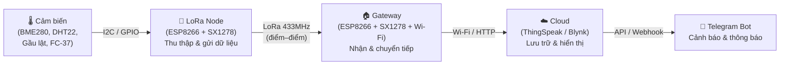
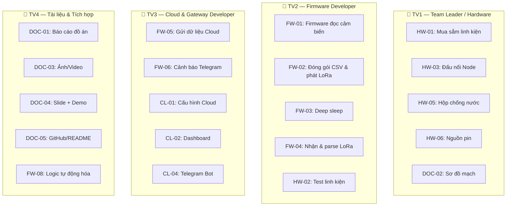
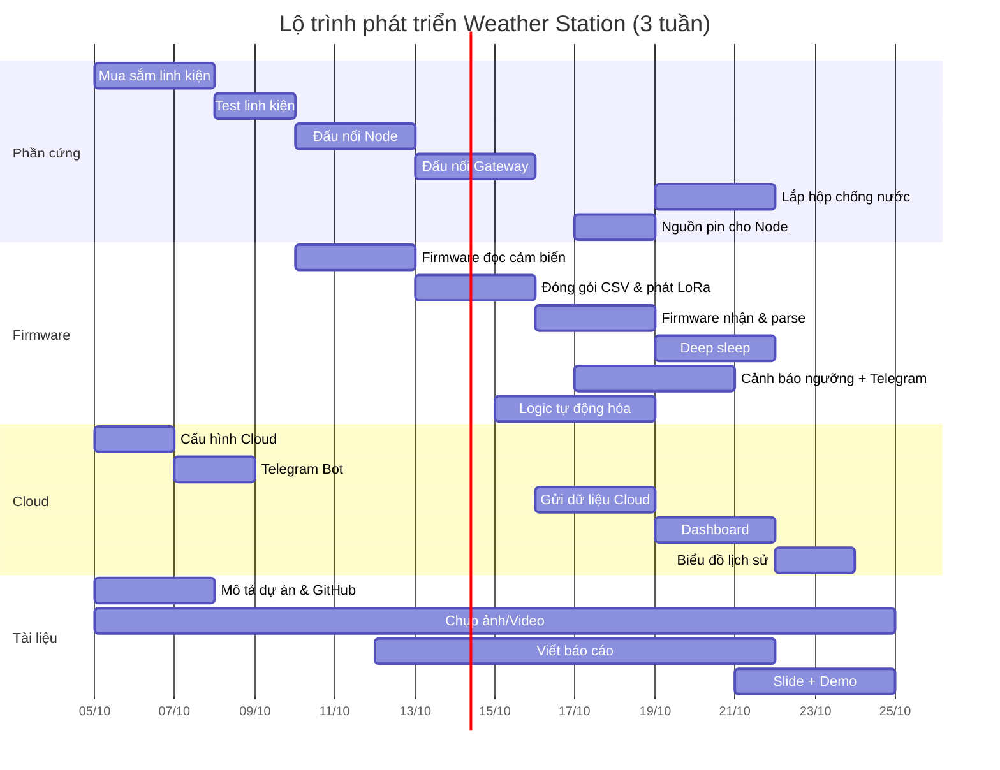

# 🌦️ Weather Station — Báo cáo Tổng quan Hệ thống IoT

> **Môn học:** IOT102 — Internet of Things  
> **Dự án:** Trạm quan trắc thời tiết mini dùng LoRa & ESP8266  
> **Số thành viên:** 4 người  
> **Thời gian thực hiện:** 2–3 tuần  
> **Ngày lập:** 03/10/2026

---

## 📋 Mục lục

1. [Giới thiệu dự án](#1-giới-thiệu-dự-án)
2. [Kiến trúc hệ thống](#2-kiến-trúc-hệ-thống)
3. [Các chức năng chính](#3-các-chức-năng-chính)
4. [Thành phần phần cứng (BOM)](#4-thành-phần-phần-cứng-bom)
5. [Giao thức truyền thông LoRa](#5-giao-thức-truyền-thông-lora)
6. [Sơ đồ đấu nối phần cứng](#6-sơ-đồ-đấu-nối-phần-cứng)
7. [Ngưỡng cảnh báo & chống spam](#7-ngưỡng-cảnh-báo--chống-spam)
8. [Mục tiêu dự án](#8-mục-tiêu-dự-án)
9. [Hạng mục cần thực hiện (Task Breakdown)](#9-hạng-mục-cần-thực-hiện-task-breakdown)
10. [Phân bổ nhiệm vụ cho 4 thành viên](#10-phân-bổ-nhiệm-vụ-cho-4-thành-viên)
11. [Lộ trình phát triển 2–3 tuần](#11-lộ-trình-phát-triển-23-tuần)
12. [Rủi ro & lưu ý quan trọng](#12-rủi-ro--lưu-ý-quan-trọng)

---

## 1. Giới thiệu dự án

### 1.1. Tổng quan

Dự án **Weather Station** xây dựng một hệ thống IoT quan trắc thời tiết mini, sử dụng mô hình **3 lớp**:

```
Sensor Node (Cảm biến) → LoRa Node (ESP8266 + SX1278) → Gateway (ESP8266 + SX1278 + Wi-Fi) → Cloud
```

Hệ thống đo các thông số: **nhiệt độ, độ ẩm, áp suất, lượng mưa**, hiển thị dashboard thời gian thực và gửi cảnh báo qua **Telegram** khi giá trị vượt ngưỡng.

### 1.2. Mô hình truyền thông

- **LoRa điểm–điểm** (point-to-point), **không** sử dụng LoRaWAN.
- Node đặt **ngoài trời** để đo đạc.
- Gateway đặt **trong nhà** nơi có Wi-Fi ổn định.
- Hai bên liên lạc bằng LoRa qua module **SX1278 (433 MHz)**.

> [!IMPORTANT]
> Đây là mô hình LoRa điểm–điểm phục vụ học tập (gateway đơn kênh), **không phải** mạng LoRaWAN đầy đủ nhiều gateway — cần ghi rõ điều này trong báo cáo và phần trình bày.

---

## 2. Kiến trúc hệ thống

### 2.1. Sơ đồ 4 khối chính



### 2.2. Mô tả từng khối

| Khối | Vai trò | Phần cứng chính |
|------|---------|-----------------|
| **Cảm biến** | Thu thập dữ liệu môi trường | BME280 (nhiệt độ/ẩm/áp suất), DHT22 (đối chứng), Gầu lật/FC-37 (mưa) |
| **LoRa Node** | Đọc cảm biến, đóng gói & phát gói LoRa | ESP8266 NodeMCU + SX1278 + ăng-ten 433MHz |
| **Gateway** | Nhận gói LoRa, xử lý, gửi lên Cloud + cảnh báo | ESP8266 NodeMCU + SX1278 + Wi-Fi + OLED/LED/Buzzer |
| **Cloud** | Lưu trữ, trực quan hóa, cung cấp API | ThingSpeak / Blynk / Firebase |

---

## 3. Các chức năng chính

### 3.1. 🔴 Theo dõi thời tiết theo thời gian thực

Hệ thống thu thập liên tục các thông số:
- **Nhiệt độ** (°C) — từ BME280/DHT22
- **Độ ẩm** (%RH) — từ BME280/DHT22
- **Áp suất** (hPa) — từ BME280
- **Lượng mưa** (mm) — từ gầu lật hoặc FC-37

Dữ liệu được gửi về server (chu kỳ **60 giây**) để người dùng theo dõi liên tục qua **Dashboard** thời gian thực.

### 3.2. 🟠 Cảnh báo sớm khi thời tiết bất thường

Khi một thông số **vượt ngưỡng** đã cài đặt:
- Hệ thống tự động gửi **cảnh báo qua Telegram Bot**
- Sử dụng cơ chế **hysteresis** + **cooldown** (tối thiểu 15 phút) để tránh spam
- Gửi tin **"đã ổn định"** khi phục hồi
- Gộp nhiều cảnh báo thành 1 tin nếu nhiều thông số vi phạm cùng lúc

**Ví dụ tin cảnh báo:**
```
[CANH BAO] Weather Station - Node N01
Nhiet do cao: 36.4 C (nguong 35 C)
Do am: 62 % | Ap suat: 1005.2 hPa | Mua: 0.0 mm/h
RSSI: -92 dBm | Thoi gian: 14:32 19/09/2026
```

### 3.3. 🟢 Ứng dụng cho nông nghiệp

Dữ liệu thời tiết hỗ trợ:
- Quyết định **tưới tiêu** dựa trên độ ẩm và lượng mưa
- **Chăm sóc cây trồng** theo điều kiện nhiệt độ
- **Bảo vệ mùa vụ** khi có cảnh báo thời tiết bất thường
- Đặc biệt phù hợp cho những khu vực cần giám sát môi trường liên tục

### 3.4. 🔵 Tự động hóa các hệ thống khác

Dữ liệu thời tiết trở thành **input** cho hệ thống tự động:

| Điều kiện | Hành động tự động |
|-----------|-------------------|
| 🌧️ Có mưa | Ngừng tưới cây |
| 🌡️ Nhiệt độ cao | Bật quạt làm mát |
| 💧 Độ ẩm thấp | Kích hoạt hệ thống tưới |
| ⚠️ Điều kiện nguy hiểm | Gửi cảnh báo khẩn cấp |

> [!TIP]
> Để hiện thực chức năng tự động hóa, Gateway có thể gửi lệnh điều khiển thông qua MQTT hoặc HTTP API tới các thiết bị actuator (relay, van nước, quạt...).

### 3.5. 🟣 Giám sát môi trường tại các khu vực xa

- Phù hợp triển khai **node cảm biến** ở: nông trại, vùng núi, khu rừng, công trình xây dựng...
- Những nơi kéo dây mạng hoặc cấp Internet trực tiếp khó khăn
- **LoRa** có khả năng:
  - Truyền dữ liệu **xa** (hàng km trong điều kiện lý tưởng)
  - **Tiêu thụ năng lượng thấp** → phù hợp với sensor node hoạt động bằng **pin hoặc năng lượng mặt trời**
  - Duy trì hoạt động lâu dài mà không cần bảo trì nguồn điện thường xuyên

---

## 4. Thành phần phần cứng (BOM)

### 4.1. Danh sách linh kiện ( tham khảo giá thôi)

| STT | Linh kiện | SL | Đơn giá (đ) | Thành tiền (đ) | Ghi chú |
|-----|-----------|:--:|:-----------:|:--------------:|---------|
| 1 | ESP8266 NodeMCU v3 (CH340/CP2102) | 2 | 100.000 | 200.000 | 1 Node + 1 Gateway |
| 2 | Module LoRa SX1278 Ra‑02, 433 MHz | 2 | 130.000 | 260.000 | 1 Node + 1 Gateway |
| 3 | Bo chuyển chân Ra‑01/Ra‑02 (2.0→2.54mm) | 2 | 20.000 | 40.000 | Bỏ nếu module đã có chân 2.54mm |
| 4 | Ăng‑ten 433 MHz (SMA/lò xo) + dây | 2 | 40.000 | 80.000 | **Bắt buộc** khi phát |
| 5 | Cảm biến BME280 (I2C, 3.3V) | 1 | 110.000 | 110.000 | Kiểm tra chip ID `0x60` |
| 6 | Cảm biến DHT22 (AM2302) | 1 | 100.000 | 100.000 | Tùy chọn: đối chứng |
| 7 | Module cảm biến mưa FC‑37/YL‑83 | 1 | 20.000 | 20.000 | Tùy chọn: phát hiện có/không mưa |
| 8 | Cảm biến mưa gầu lật (tipping bucket) | 1 | 400.000 | 400.000 | Đo mm; có thể tự chế 3D |
| 9 | Breadboard 830 lỗ | 2 | 30.000 | 60.000 | |
| 10 | Dây jumper các loại | 1 | 60.000 | 60.000 | |
| 11 | Tụ, điện trở, LED, buzzer | 1 | 30.000 | 30.000 | Tụ đặt sát nguồn LoRa |
| 12 | Pin 18650×2 + hộp pin + TP4056 + boost | 1 | 150.000 | 150.000 | Nguồn Node ngoài trời |
| 13 | Màn hình OLED SSD1306 0.96" I2C | 1 | 70.000 | 70.000 | Tùy chọn: debug Gateway |
| 14 | Hộp nhựa chống nước IP65 | 2 | 50.000 | 100.000 | |
| 15 | Vật liệu che nắng, giá đỡ | 1 | 80.000 | 80.000 | |
| | **CỘNG** | | | **1.760.000** | |
| | Dự phòng 10% | | | 176.000 | |
| | **TỔNG DỰ TOÁN** | | | **1.936.000** | |

### 4.2. Phương án tiết kiệm

Bỏ DHT22, OLED và gầu lật (chỉ dùng FC-37 phát hiện mưa):
- **≈ 1.190.000 đ** trước dự phòng
- Đánh đổi: không có lượng mưa định lượng (mm)

> [!WARNING]
> Nên mua dự phòng **1 module LoRa** hoặc **1 ESP8266** vì đây là linh kiện dễ hỏng do đấu sai điện áp/thiếu ăng-ten.

---

## 5. Giao thức truyền thông LoRa

### 5.1. Tham số LoRa đề xuất

| Tham số | Giá trị | Ghi chú |
|---------|---------|---------|
| Tần số | 433 MHz (`433E6`) | Khớp module SX1278 + ăng-ten |
| Spreading Factor | SF7 (test bàn), SF9 (ngoài trời), SF10-12 (xa hơn) | **Cả hai đầu phải cùng SF** |
| Bandwidth | 125 kHz (`125E3`) | — |
| Coding Rate | 4/5 (`setCodingRate4(5)`) | — |
| Công suất phát | 5–10 dBm (gần), 17 dBm (xa) | Không cần phát mạnh khi gần |
| Sync word | Giá trị riêng, VD: `0xF3` | **Tránh `0x34`** (LoRaWAN) |
| CRC | Bật (`enableCrc()`) | — |
| Chu kỳ gửi | 60 giây (test: 10 giây) | Đồng bộ giới hạn cloud |

### 5.2. Định dạng gói tin (CSV, 7 trường)

```
N01,125,28.6,72.4,1008.7,3.35,3.92
```

| # | Trường | Kiểu | Đơn vị | Ví dụ | Mô tả |
|---|--------|------|--------|-------|-------|
| 1 | Node ID | Văn bản | — | `N01` | Định danh node |
| 2 | seq | Số nguyên | — | `125` | Số thứ tự gói (tính PDR) |
| 3 | temp | Thực (1 số lẻ) | °C | `28.6` | Nhiệt độ |
| 4 | hum | Thực (1 số lẻ) | %RH | `72.4` | Độ ẩm tương đối |
| 5 | press | Thực (1 số lẻ) | hPa | `1008.7` | Áp suất |
| 6 | rain_total | Thực (2 số lẻ) | mm | `3.35` | Lượng mưa tích lũy |
| 7 | vbat | Thực (2 số lẻ) | V | `3.92` | Điện áp pin |

> Kích thước gói ≈ 35–40 byte → SF9/BW125 kHz → time-on-air ≈ 0,25–0,29 giây (rất an toàn về duty cycle).

---

## 6. Sơ đồ đấu nối phần cứng

### 6.1. Đấu nối Node

| Thiết bị | Chân thiết bị | Chân NodeMCU | Ghi chú |
|----------|---------------|:------------:|---------|
| **SX1278** | VCC / GND | 3V3 / GND | Thêm tụ 100–470µF sát module |
| | SCK / MISO / MOSI | D5 / D6 / D7 | SPI |
| | NSS/CS · RESET | D8 · D0 | DIO0 không nối (polling) |
| **BME280** | VIN/GND · SCL/SDA | 3V3/GND · D1/D2 | I2C `0x76` hoặc `0x77` |
| **Gầu lật** | Dây 1 / Dây 2 | D3 / GND | INPUT_PULLUP, ngắt FALLING |
| **DHT22** | DATA | D4 | Điện trở kéo lên 10kΩ |

### 6.2. Đấu nối Gateway

| Thiết bị | Chân → NodeMCU | Ghi chú |
|----------|----------------|---------|
| **SX1278** | 3V3, GND, SCK→D5, MISO→D6, MOSI→D7, NSS→D8, RESET→D0 | Đấu giống hệt Node |
| **OLED SSD1306** | 3V3, GND, SCL→D1, SDA→D2 | Debug, hiển thị RSSI |
| **LED** | LED trên board → D4 | Sáng khi mức thấp |
| **Buzzer** | D3 qua transistor NPN → GND | Buzzer chủ động |

> [!CAUTION]
> **Những điều dễ làm hỏng module LoRa:**
> 1. ❌ Phát khi chưa gắn ăng-ten → hỏng tầng khuếch đại
> 2. ❌ Cấp 5V vào chân VCC hoặc tín hiệu (chip chỉ 1,8–3,7V)
> 3. ❌ Nguồn 3,3V yếu/nhiễu → module reset khi phát
> 4. ❌ Chân SPI cắm/hàn lỏng → lỗi "LoRa init failed"

---

## 7. Ngưỡng cảnh báo & chống spam

### 7.1. Bảng ngưỡng cảnh báo

| Thông số | Điều kiện cảnh báo | Trở lại bình thường | Ý nghĩa |
|----------|:------------------:|:-------------------:|---------|
| Nhiệt độ cao | T > 35°C | T < 34°C | Nắng nóng |
| Nhiệt độ thấp | T < 15°C | T > 16°C | Trời rét |
| Độ ẩm cao | H > 90% | H < 87% | Nấm mốc |
| Độ ẩm thấp | H < 30% | H > 33% | Không khí khô |
| Áp suất thấp | P < 1000 hPa | P > 1002 hPa | Có thể mưa/bão |
| Cường độ mưa | ≥ 7,6 mm/h | < 2,5 mm/h | Mưa lớn |
| Mưa 24h | ≥ 50 mm | Qua chu kỳ 24h | Ngập úng |
| Mất kết nối | Không nhận gói > 3 chu kỳ | Nhận lại gói | Node hỏng/hết pin |

### 7.2. Cơ chế chống spam

- **Hysteresis**: chỉ tắt cảnh báo khi giá trị về hẳn vùng an toàn
- **Cooldown**: tối thiểu **15 phút** mỗi loại cảnh báo
- **Tin phục hồi**: gửi thêm tin "đã ổn định" khi phục hồi
- **Gộp tin**: gộp thành 1 tin nếu nhiều thông số vi phạm cùng lúc

---

## 8. Mục tiêu dự án

### 8.1. Mục tiêu tổng quát

1. ✅ Xây dựng **hệ thống IoT hoàn chỉnh** từ Sensor → Cloud → Notification
2. ✅ Ứng dụng **LoRa** cho truyền thông không dây tiêu thụ năng lượng thấp
3. ✅ Thu thập và hiển thị dữ liệu thời tiết **real-time** trên dashboard
4. ✅ Cảnh báo tự động qua Telegram khi thời tiết bất thường
5. ✅ Cung cấp dữ liệu đầu vào cho **tự động hóa** (tưới tiêu, làm mát...)

### 8.2. Mục tiêu cụ thể theo tuần

| Tuần | Mục tiêu | Kết quả đầu ra |
|:----:|----------|----------------|
| **Tuần 1** | Chuẩn bị phần cứng + Test linh kiện + Lập trình Node cơ bản | Node đọc được dữ liệu cảm biến & phát LoRa |
| **Tuần 2** | Xây dựng Gateway + Kết nối Cloud + Dashboard | Gateway nhận LoRa & đẩy dữ liệu lên Cloud thành công |
| **Tuần 3** | Cảnh báo Telegram + Tích hợp & Test ngoài trời + Báo cáo | Hệ thống hoàn chỉnh, demo + Nộp báo cáo |

---

## 9. Hạng mục cần thực hiện (Task Breakdown)

### 9.1. Phần cứng (Hardware)

| ID | Task | Độ ưu tiên | Ghi chú |
|----|------|:----------:|---------|
| HW-01 | Mua sắm linh kiện theo BOM | 🔴 Cao | Tuần 1 |
| HW-02 | Test từng linh kiện riêng lẻ (ESP8266, SX1278, BME280, DHT22...) | 🔴 Cao | Sketch test riêng |
| HW-03 | Đấu nối Node trên breadboard | 🔴 Cao | Theo sơ đồ mục 6.1 |
| HW-04 | Đấu nối Gateway trên breadboard | 🔴 Cao | Theo sơ đồ mục 6.2 |
| HW-05 | Lắp hộp chống nước, giá đỡ che nắng | 🟡 Trung bình | Tuần 3 |
| HW-06 | Lắp nguồn pin (18650 + TP4056) cho Node | 🟡 Trung bình | Tuần 2–3 |

### 9.2. Firmware (Embedded Software)

| ID | Task | Độ ưu tiên | Ghi chú |
|----|------|:----------:|---------|
| FW-01 | Firmware Node: đọc BME280 + DHT22 + gầu lật | 🔴 Cao | Arduino IDE / PlatformIO |
| FW-02 | Firmware Node: đóng gói CSV & phát LoRa | 🔴 Cao | Theo format mục 5.2 |
| FW-03 | Firmware Node: quản lý chu kỳ gửi (deep sleep) | 🟡 Trung bình | Tiết kiệm pin |
| FW-04 | Firmware Gateway: nhận gói LoRa & parse CSV | 🔴 Cao | |
| FW-05 | Firmware Gateway: gửi dữ liệu lên Cloud (HTTP/MQTT) | 🔴 Cao | ThingSpeak/Blynk API |
| FW-06 | Firmware Gateway: xử lý ngưỡng cảnh báo + gửi Telegram | 🔴 Cao | Hysteresis + Cooldown |
| FW-07 | Firmware Gateway: hiển thị OLED + LED/Buzzer báo động | 🟢 Thấp | Tùy chọn |
| FW-08 | Firmware Gateway: logic tự động hóa (ngừng tưới khi mưa, bật quạt khi nóng...) | 🟡 Trung bình | Giai đoạn nâng cao |

### 9.3. Cloud & Dashboard

| ID | Task | Độ ưu tiên | Ghi chú |
|----|------|:----------:|---------|
| CL-01 | Tạo tài khoản & cấu hình kênh ThingSpeak/Blynk | 🔴 Cao | |
| CL-02 | Thiết kế Dashboard hiển thị real-time | 🔴 Cao | Nhiệt độ, Ẩm, Áp suất, Mưa |
| CL-03 | Cấu hình biểu đồ lịch sử (chart) | 🟡 Trung bình | |
| CL-04 | Cấu hình Telegram Bot + Webhook | 🔴 Cao | |
| CL-05 | Test API gửi/nhận dữ liệu | 🔴 Cao | |

### 9.4. Tài liệu & Báo cáo

| ID | Task | Độ ưu tiên | Ghi chú |
|----|------|:----------:|---------|
| DOC-01 | Viết báo cáo đồ án (Word/LaTeX) | 🔴 Cao | |
| DOC-02 | Vẽ sơ đồ khối, sơ đồ mạch | 🔴 Cao | Fritzing / Draw.io |
| DOC-03 | Chụp ảnh/quay video quá trình làm | 🟡 Trung bình | Minh chứng |
| DOC-04 | Chuẩn bị slide + demo | 🔴 Cao | |
| DOC-05 | Viết README & tài liệu kỹ thuật (GitHub) | 🟡 Trung bình | |

---

## 10. Phân bổ nhiệm vụ cho 4 thành viên

### 10.1. Bảng phân công



### 10.2. Chi tiết phân công

#### 👤 Thành viên 1 — Team Leader / Phần cứng

| Tuần | Nhiệm vụ | Task ID |
|:----:|----------|---------|
| T1 | Lên BOM, mua sắm linh kiện, đấu nối Node | HW-01, HW-03 |
| T2 | Đấu nối Gateway, lắp nguồn pin | HW-04, HW-06 |
| T3 | Lắp hộp chống nước, vẽ sơ đồ mạch hoàn chỉnh | HW-05, DOC-02 |

**Kỹ năng cần có:** Hiểu sơ đồ mạch, khả năng hàn/đấu dây, quản lý nhóm.

#### 👤 Thành viên 2 — Firmware Developer (Node)

| Tuần | Nhiệm vụ | Task ID |
|:----:|----------|---------|
| T1 | Test linh kiện, viết firmware đọc cảm biến BME280/DHT22/gầu lật | HW-02, FW-01 |
| T2 | Đóng gói CSV, phát LoRa, viết firmware nhận & parse ở Gateway | FW-02, FW-04 |
| T3 | Tối ưu deep sleep, fix bug, test ngoài trời | FW-03 |

**Kỹ năng cần có:** Lập trình Arduino/C++, hiểu giao thức SPI/I2C, debug serial.

#### 👤 Thành viên 3 — Cloud & Gateway Developer

| Tuần | Nhiệm vụ | Task ID |
|:----:|----------|---------|
| T1 | Tạo tài khoản Cloud, cấu hình kênh, tạo Telegram Bot | CL-01, CL-04, CL-05 |
| T2 | Viết firmware Gateway gửi dữ liệu lên Cloud, thiết kế Dashboard | FW-05, CL-02 |
| T3 | Xử lý ngưỡng cảnh báo + gửi Telegram, biểu đồ lịch sử | FW-06, CL-03 |

**Kỹ năng cần có:** HTTP/MQTT protocol, API integration, ThingSpeak/Blynk, Telegram Bot API.

#### 👤 Thành viên 4 — Tài liệu & Tích hợp

| Tuần | Nhiệm vụ | Task ID |
|:----:|----------|---------|
| T1 | Viết bản mô tả dự án, tạo repo GitHub, chụp ảnh quá trình | DOC-01, DOC-05, DOC-03 |
| T2 | Viết logic tự động hóa, hỗ trợ test, cập nhật báo cáo | FW-08, FW-07 |
| T3 | Hoàn thiện báo cáo, chuẩn bị slide, demo | DOC-01, DOC-04 |

**Kỹ năng cần có:** Viết tài liệu kỹ thuật, PowerPoint/Canva, khả năng tổng hợp & trình bày.

---

## 11. Lộ trình phát triển 2–3 tuần

### 11.1. Gantt Chart (3 tuần)



### 11.2. Milestone quan trọng

| Mốc | Thời điểm | Tiêu chí hoàn thành |
|-----|:---------:|----------------------|
| **M1** — Linh kiện sẵn sàng | Cuối ngày 3, Tuần 1 | Tất cả linh kiện đã có, test OK |
| **M2** — Node hoạt động | Cuối Tuần 1 | Node đọc cảm biến + phát LoRa thành công |
| **M3** — Gateway hoạt động | Giữa Tuần 2 | Gateway nhận LoRa + gửi Cloud thành công |
| **M4** — Dashboard live | Cuối Tuần 2 | Dashboard hiển thị dữ liệu real-time |
| **M5** — Cảnh báo hoạt động | Đầu Tuần 3 | Telegram nhận cảnh báo khi vượt ngưỡng |
| **M6** — Tích hợp hoàn chỉnh | Giữa Tuần 3 | Test ngoài trời thành công |
| **M7** — Nộp bài & Demo | Cuối Tuần 3 | Báo cáo + Slide + Demo hoàn chỉnh |

---

## 12. Rủi ro & lưu ý quan trọng

### 12.1. Rủi ro kỹ thuật

| Rủi ro | Mức độ | Biện pháp phòng tránh |
|--------|:------:|----------------------|
| Module LoRa hỏng do đấu sai điện áp | 🔴 Cao | Kiểm tra kỹ trước khi cấp nguồn, mua dự phòng |
| Phát LoRa không gắn ăng-ten | 🔴 Cao | **LUÔN** gắn ăng-ten trước khi phát |
| Chân SPI lỏng → "LoRa init failed" | 🟡 TB | Hàn chắc hoặc dùng breadboard chất lượng |
| BME280 giả (thực ra là BMP280) | 🟡 TB | Kiểm tra chip ID `0x60` |
| Wi-Fi Gateway không ổn định | 🟡 TB | Đặt Gateway gần router, retry logic |
| Nguồn pin yếu khi phát LoRa | 🟡 TB | Thêm tụ 100–470µF sát module LoRa |

### 12.2. Rủi ro dự án

| Rủi ro | Biện pháp |
|--------|-----------|
| Linh kiện giao trễ | Đặt mua sớm, mua từ shop uy tín |
| Thành viên không hoàn thành đúng hạn | Họp nhanh hàng ngày (standup), có buffer time |
| Thiếu kinh nghiệm lập trình embedded | Tham khảo code mẫu, hỗ trợ chéo giữa thành viên |
| Xung đột code | Sử dụng Git/GitHub, branch riêng cho mỗi người |

### 12.3. Checklist trước khi demo

- [ ] Node đọc đúng 4 thông số (nhiệt độ, ẩm, áp suất, mưa)
- [ ] Node gửi gói LoRa đúng format CSV
- [ ] Gateway nhận và parse gói LoRa chính xác
- [ ] Gateway gửi dữ liệu lên Cloud thành công
- [ ] Dashboard hiển thị dữ liệu real-time
- [ ] Telegram nhận cảnh báo khi vượt ngưỡng
- [ ] Cơ chế chống spam hoạt động đúng (hysteresis + cooldown)
- [ ] Hệ thống hoạt động ổn định ≥ 30 phút liên tục
- [ ] Báo cáo + Slide + Demo đã chuẩn bị xong
- [ ] Ghi rõ: đây là **LoRa điểm–điểm**, không phải LoRaWAN

---

> **Ghi chú:** Tài liệu này được tạo dựa trên phân tích file sơ đồ hệ thống `WeatherStation_so_do_he_thong.html` và các yêu cầu chức năng chính của dự án IoT Weather Station.
