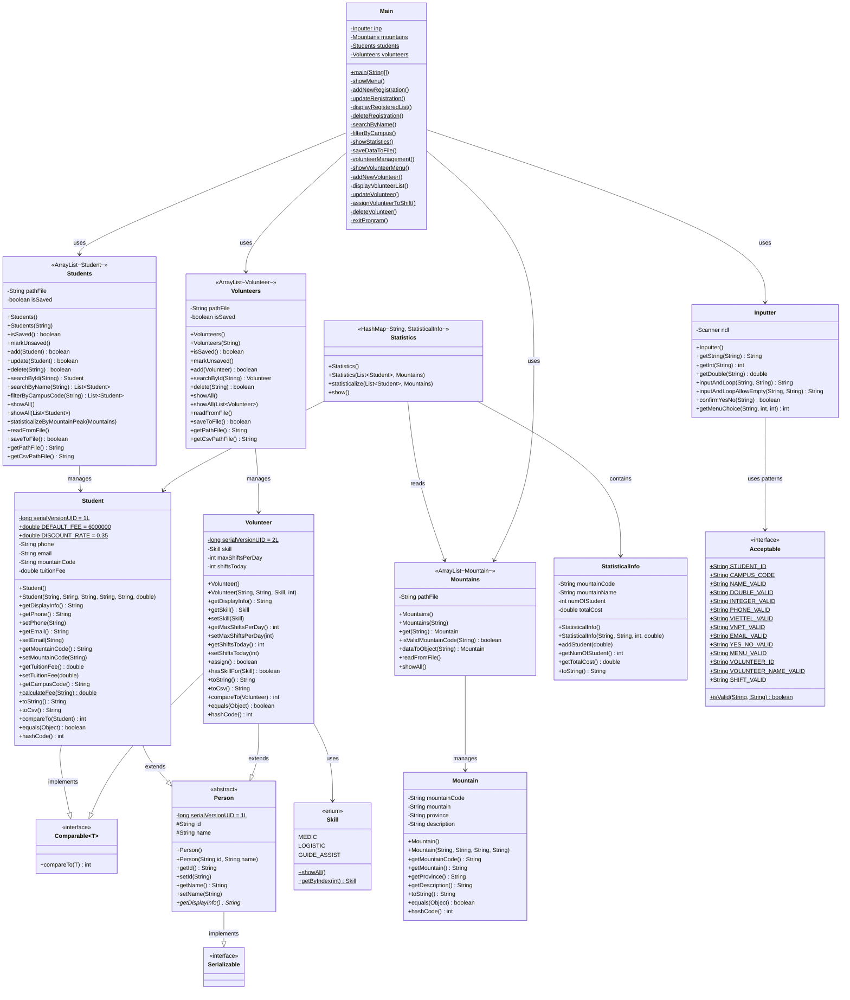
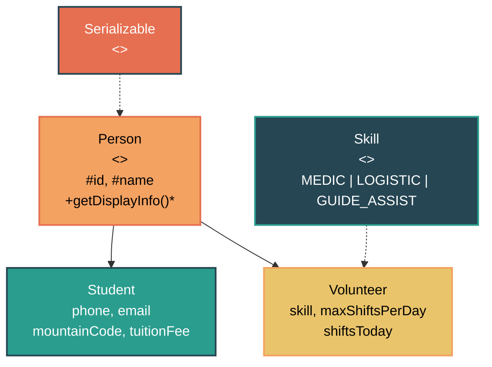

# Sơ đồ Class - Hệ thống Mountain Hiking

## Tổng quan cấu trúc

Hệ thống gồm **12 class/interface/enum**, chia thành 4 nhóm chính:

| Nhóm | Thành phần |
|------|-----------|
| **Person hierarchy** | `Person` (abstract) → `Student`, `Volunteer` |
| **Manager (Collection)** | `Students`, `Volunteers`, `Mountains` |
| **Data/Model** | `Mountain`, `Skill` (enum), `StatisticalInfo`, `Statistics` |
| **Utility** | `Acceptable` (interface), `Inputter`, `Main` |

---

## Class Diagram đầy đủ

---

## Sơ đồ quan hệ kế thừa (đơn giản)

---

## Danh sách file (12 files)

| # | File | Loại | Vai trò |
|---|------|------|---------|
| 1 | [Person.java](file:///c:/Users/Khuong/Desktop/FPTU/LAB211/01_J1.L.P0027.MountainHiking%20_200LOC/Project1_MountainHiking/src/Person.java) | Abstract class | Lớp gốc kế thừa, chứa `id`, `name` |
| 2 | [Student.java](file:///c:/Users/Khuong/Desktop/FPTU/LAB211/01_J1.L.P0027.MountainHiking%20_200LOC/Project1_MountainHiking/src/Student.java) | Class | Sinh viên đăng ký leo núi |
| 3 | [Volunteer.java](file:///c:/Users/Khuong/Desktop/FPTU/LAB211/01_J1.L.P0027.MountainHiking%20_200LOC/Project1_MountainHiking/src/Volunteer.java) | Class | Tình nguyện viên (Đề 31) |
| 4 | [Skill.java](file:///c:/Users/Khuong/Desktop/FPTU/LAB211/01_J1.L.P0027.MountainHiking%20_200LOC/Project1_MountainHiking/src/Skill.java) | Enum | MEDIC, LOGISTIC, GUIDE_ASSIST |
| 5 | [Students.java](file:///c:/Users/Khuong/Desktop/FPTU/LAB211/01_J1.L.P0027.MountainHiking%20_200LOC/Project1_MountainHiking/src/Students.java) | Manager | Quản lý danh sách Student |
| 6 | [Volunteers.java](file:///c:/Users/Khuong/Desktop/FPTU/LAB211/01_J1.L.P0027.MountainHiking%20_200LOC/Project1_MountainHiking/src/Volunteers.java) | Manager | Quản lý danh sách Volunteer |
| 7 | [Mountain.java](file:///c:/Users/Khuong/Desktop/FPTU/LAB211/01_J1.L.P0027.MountainHiking%20_200LOC/Project1_MountainHiking/src/Mountain.java) | Class | Thông tin núi |
| 8 | [Mountains.java](file:///c:/Users/Khuong/Desktop/FPTU/LAB211/01_J1.L.P0027.MountainHiking%20_200LOC/Project1_MountainHiking/src/Mountains.java) | Manager | Quản lý danh sách núi |
| 9 | [StatisticalInfo.java](file:///c:/Users/Khuong/Desktop/FPTU/LAB211/01_J1.L.P0027.MountainHiking%20_200LOC/Project1_MountainHiking/src/StatisticalInfo.java) | Class | Dữ liệu thống kê 1 đỉnh |
| 10 | [Statistics.java](file:///c:/Users/Khuong/Desktop/FPTU/LAB211/01_J1.L.P0027.MountainHiking%20_200LOC/Project1_MountainHiking/src/Statistics.java) | Class | Tính toán & hiển thị thống kê |
| 11 | [Acceptable.java](file:///c:/Users/Khuong/Desktop/FPTU/LAB211/01_J1.L.P0027.MountainHiking%20_200LOC/Project1_MountainHiking/src/Acceptable.java) | Interface | Regex validation patterns |
| 12 | [Inputter.java](file:///c:/Users/Khuong/Desktop/FPTU/LAB211/01_J1.L.P0027.MountainHiking%20_200LOC/Project1_MountainHiking/src/Inputter.java) | Utility | Nhập liệu từ console |
| 13 | [Main.java](file:///c:/Users/Khuong/Desktop/FPTU/LAB211/01_J1.L.P0027.MountainHiking%20_200LOC/Project1_MountainHiking/src/Main.java) | Entry point | Menu chính + Volunteer sub-menu |

---

## Design Patterns sử dụng

| Pattern | Áp dụng |
|---------|---------|
| **Abstraction + Inheritance** | `Person` → `Student` / `Volunteer` |
| **Polymorphism** | `getDisplayInfo()` — mỗi lớp con tự định nghĩa |
| **Enum** | `Skill` — type-safe, có helper methods |
| **Manager/Repository** | `Students`, `Volunteers`, `Mountains` — quản lý collection |
| **Serialization** | Lưu/đọc `.dat` qua `ObjectInputStream/OutputStream` |
| **Strategy (validation)** | `Acceptable` interface — regex patterns tách riêng |
