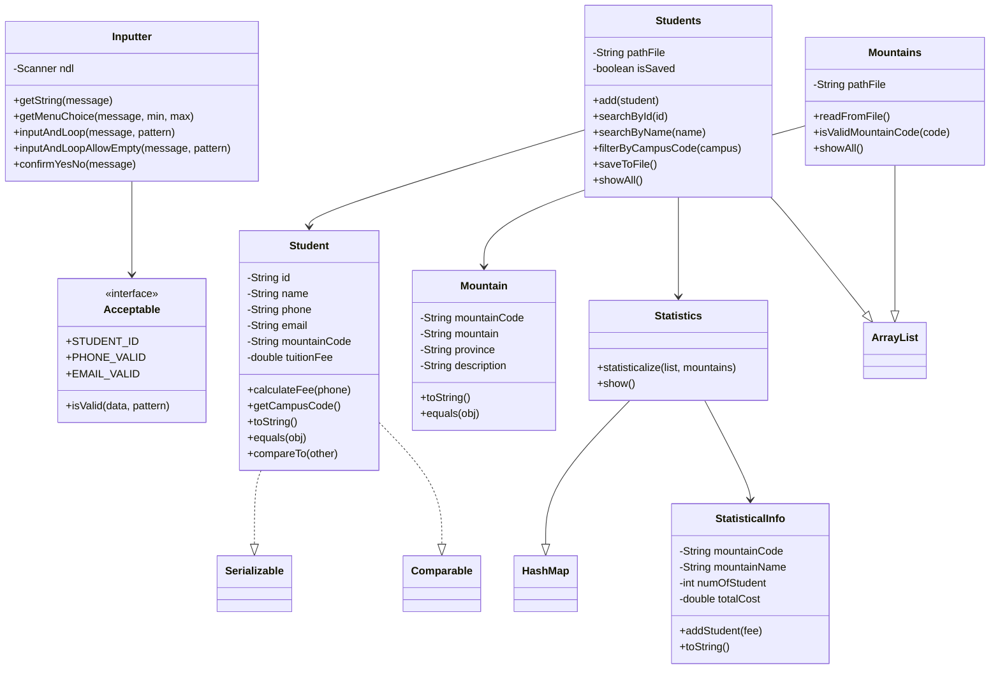
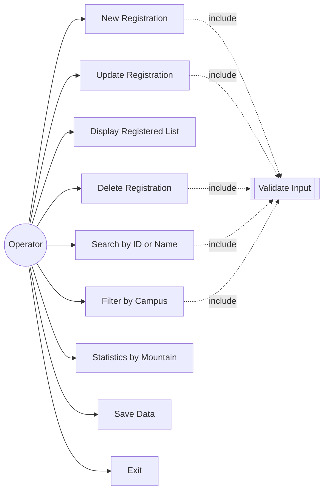
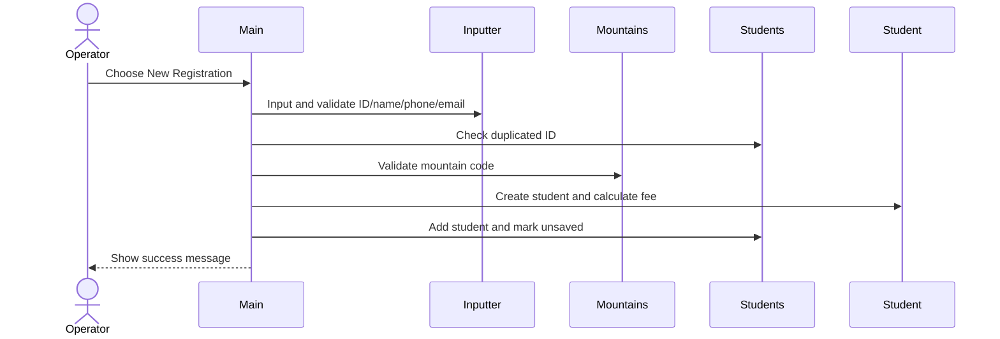

# Mountain Hiking Registration - Short Report

## 1. Objective

This console application manages student registrations for the Mountain Hiking Challenge. It supports add, update, delete, search, display, filter, statistics, save/load, and exit confirmation with validation.

## 2. Algorithm Design

```text
Load MountainList.csv into Mountains
Load registrations.dat into Students if the file exists
Repeat:
    Show menu 1..9
    Read a valid choice
    Execute the selected function
    Mark data as unsaved after Add/Update/Delete
Until user chooses Exit
If data is unsaved on Exit, ask whether to Save
```

Main menu:

1. New Registration
2. Update Registration Information
3. Display Registered List
4. Delete Registration Information
5. Search Participants by ID or Name
6. Filter Data by Campus
7. Statistics of Registration Numbers by Location
8. Save Data to File
9. Exit

## 3. Class Diagram



## 4. Use Case Diagram



## 5. Sequence Diagram - Add Student



## 6. Self-Assessment Checklist

- Menu 1..9 validates invalid numbers and does not crash.
- Add Student blocks duplicated ID, invalid name, phone, email, and mountain code.
- Search supports exact ID and case-insensitive partial name.
- Update supports Enter to keep old values and recalculates tuition fee after phone changes.
- Delete requires confirmation before removing a registration.
- Display uses aligned table columns.
- Filter campus uses the first two characters of Student ID: CE, DE, HE, SE, QE.
- Statistics count and total fee are grouped by mountain code.
- Save writes `registrations.dat` and exports `registrations.csv`.
- Exit warns the user when there are unsaved changes.
- Code uses private fields, getters/setters, constructors, `toString()`, `equals()`, `Comparable`, interface constants, and clear naming conventions.
