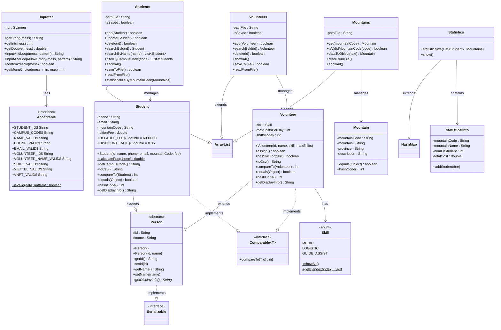
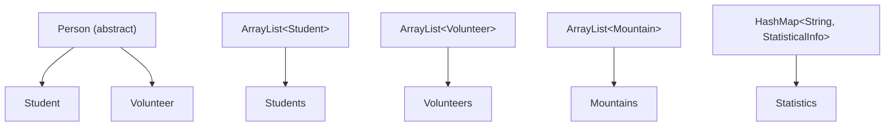
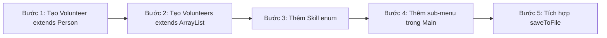
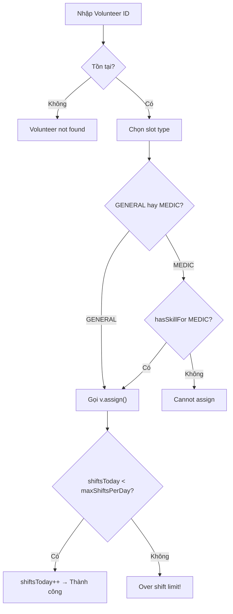
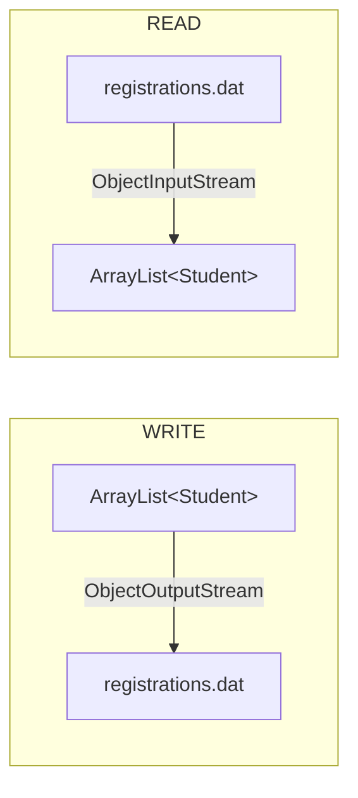
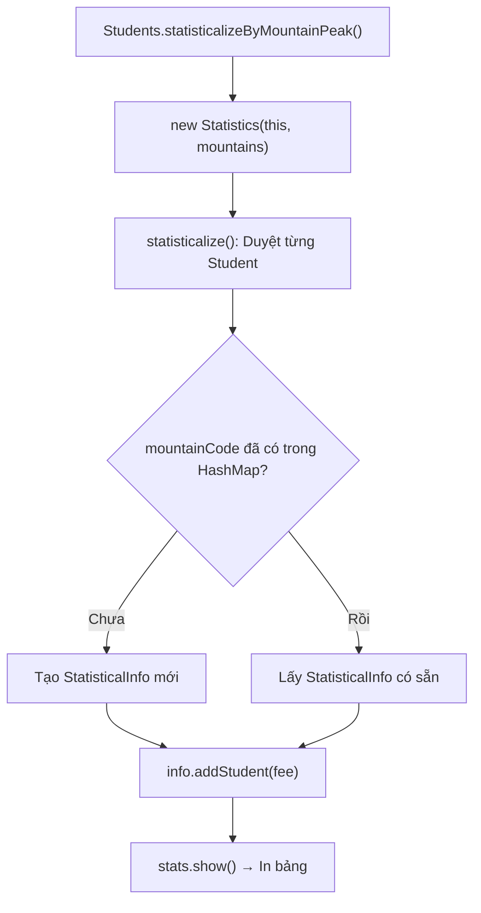
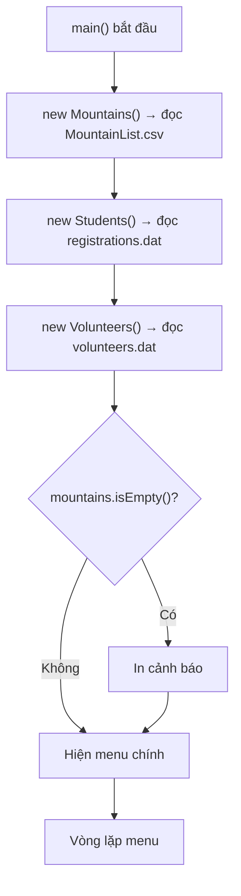
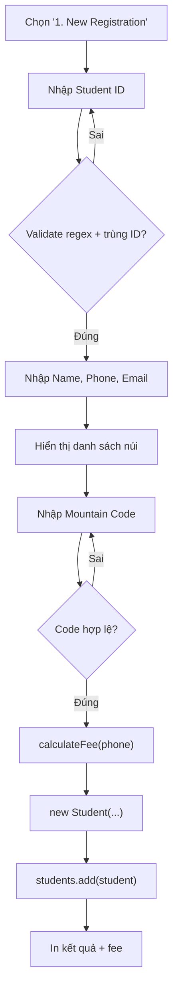
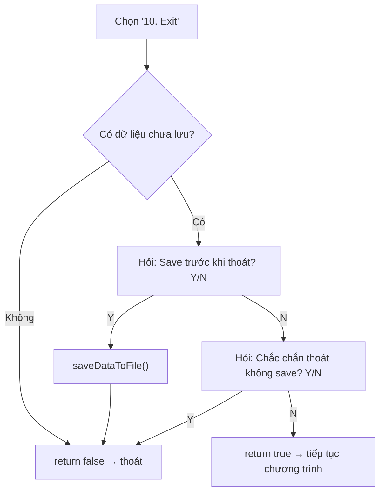

# 🏔️ PHÂN TÍCH CHI TIẾT DỰ ÁN: Mountain Hiking Challenge Registration

> **Mã đề tài:** J1.L.P0027  
> **Ngôn ngữ:** Java (Console Application)  
> **Tổng số file source:** 13 file `.java`  
> **Tổng LOC ước tính:** ~1,300+ dòng code

---

## 📋 Mục Lục

1. [Tổng quan dự án](#1-tổng-quan-dự-án)
2. [Kiến trúc tổng thể](#2-kiến-trúc-tổng-thể)
3. [Sơ đồ lớp (Class Diagram)](#3-sơ-đồ-lớp-class-diagram)
4. [Phân tích chi tiết từng class](#4-phân-tích-chi-tiết-từng-class)
5. [Các nguyên lý OOP được áp dụng](#5-các-nguyên-lý-oop-được-áp-dụng)
6. [Hệ thống mở rộng Volunteer](#6-hệ-thống-mở-rộng-volunteer)
7. [Cơ chế File I/O (Serialization & CSV)](#7-cơ-chế-file-io)
8. [Hệ thống Validation (Acceptable + Regex)](#8-hệ-thống-validation)
9. [Hệ thống Thống kê (Statistics)](#9-hệ-thống-thống-kê)
10. [Các kỹ thuật nâng cao](#10-các-kỹ-thuật-nâng-cao)
11. [Luồng hoạt động chương trình](#11-luồng-hoạt-động-chương-trình)
12. [Câu hỏi vấn đáp dự kiến](#12-câu-hỏi-vấn-đáp-dự-kiến)

---

## 1. Tổng Quan Dự Án

### Mô tả
Ứng dụng quản lý **đăng ký thử thách leo núi** (Mountain Hiking Challenge) cho sinh viên FPT University. Chương trình là ứng dụng console Java thuần (không GUI, không framework), cho phép:

- **Đăng ký sinh viên** tham gia leo núi tại các đỉnh khác nhau
- **Quản lý tình nguyện viên** (Volunteer) — phần mở rộng nâng cao
- **Lưu/đọc dữ liệu** bằng cả Serialization (`.dat`) và CSV (`.csv`)
- **Thống kê** số lượng đăng ký theo từng đỉnh núi

### Các tính năng chính (10 chức năng)

| # | Chức năng | Mô tả |
|---|-----------|-------|
| 1 | New Registration | Đăng ký sinh viên mới leo núi |
| 2 | Update Registration | Cập nhật thông tin đã đăng ký |
| 3 | Display Registered List | Hiển thị danh sách đã đăng ký (sorted) |
| 4 | Delete Registration | Xóa đăng ký (có xác nhận Y/N) |
| 5 | Search by Name / ID | Tìm kiếm theo tên hoặc mã sinh viên |
| 6 | Filter by Campus | Lọc theo campus (SE/HE/DE/QE/CE) |
| 7 | Statistics | Thống kê theo đỉnh núi |
| 8 | Save Data to File | Lưu dữ liệu `.dat` + `.csv` |
| 9 | Volunteer Management | Sub-menu quản lý tình nguyện viên (mở rộng) |
| 10 | Exit | Thoát (cảnh báo nếu chưa lưu) |

---

## 2. Kiến Trúc Tổng Thể

Dự án sử dụng kiến trúc **3-layer đơn giản** cho ứng dụng console:

```
┌──────────────────────────────────────────────────────┐
│                   PRESENTATION LAYER                 │
│                     Main.java                        │
│         (Menu, input/output, điều phối logic)        │
├──────────────────────────────────────────────────────┤
│                   BUSINESS LAYER                     │
│    Students.java │ Volunteers.java │ Mountains.java  │
│    Statistics.java │ StatisticalInfo.java             │
│         (CRUD, search, filter, thống kê)             │
├──────────────────────────────────────────────────────┤
│                     MODEL LAYER                      │
│  Person.java │ Student.java │ Volunteer.java         │
│  Mountain.java │ Skill.java (enum)                   │
│             (Entities / Data Objects)                │
├──────────────────────────────────────────────────────┤
│                   UTILITY LAYER                      │
│         Inputter.java │ Acceptable.java              │
│       (Input handling, validation, regex)             │
├──────────────────────────────────────────────────────┤
│                     DATA LAYER                       │
│  registrations.dat │ volunteers.dat (Serialization)  │
│  registrations.csv │ volunteers.csv (CSV export)     │
│  MountainList.csv (dữ liệu gốc)                     │
└──────────────────────────────────────────────────────┘
```

---

## 3. Sơ Đồ Lớp (Class Diagram)



---

## 4. Phân Tích Chi Tiết Từng Class

### 4.1 `Person.java` — Lớp trừu tượng cơ sở

[Person.java](file:///c:/Users/Khuong/Desktop/FPTU/LAB211/01_J1.L.P0027.MountainHiking%20_200LOC/Project1_MountainHiking/src/Person.java)

| Đặc điểm | Chi tiết |
|-----------|----------|
| **Loại** | `abstract class` |
| **Implements** | `Serializable` |
| **Trường** | `id` (protected), `name` (protected) |
| **Abstract method** | `getDisplayInfo()` |
| **serialVersionUID** | `1L` |

> [!IMPORTANT]
> `Person` là lớp cha dùng chung cho cả `Student` và `Volunteer`. Sử dụng `protected` cho thuộc tính để lớp con truy cập trực tiếp mà không cần getter.

**Tại sao `abstract`?**  
- Không bao giờ tạo đối tượng `Person` trực tiếp — chỉ có Student hoặc Volunteer
- Buộc lớp con phải override `getDisplayInfo()` — vì mỗi loại hiển thị khác nhau

**Tại sao `Serializable`?**  
- Để lưu object xuống file `.dat` bằng `ObjectOutputStream`
- Lớp con (Student, Volunteer) tự động inherit `Serializable`

---

### 4.2 `Student.java` — Sinh viên đăng ký leo núi

[Student.java](file:///c:/Users/Khuong/Desktop/FPTU/LAB211/01_J1.L.P0027.MountainHiking%20_200LOC/Project1_MountainHiking/src/Student.java)

| Đặc điểm | Chi tiết |
|-----------|----------|
| **Extends** | `Person` |
| **Implements** | `Comparable<Student>` |
| **Trường riêng** | `phone`, `email`, `mountainCode`, `tuitionFee` |
| **Hằng số** | `DEFAULT_FEE = 6,000,000`, `DISCOUNT_RATE = 0.35` |

**Logic tính phí đặc biệt — [calculateFee()](file:///c:/Users/Khuong/Desktop/FPTU/LAB211/01_J1.L.P0027.MountainHiking%20_200LOC/Project1_MountainHiking/src/Student.java#L73-L79):**

```java
public static double calculateFee(String phone) {
    if (Acceptable.isValid(phone, Acceptable.VIETTEL_VALID)
            || Acceptable.isValid(phone, Acceptable.VNPT_VALID)) {
        return DEFAULT_FEE * (1 - DISCOUNT_RATE); // = 3,900,000 VND
    }
    return DEFAULT_FEE; // = 6,000,000 VND
}
```

> [!TIP]
> Nếu số điện thoại thuộc nhà mạng **Viettel** hoặc **VNPT** → giảm 35%. Đây là business logic quan trọng — giảng viên hay hỏi!

**Phương thức đáng chú ý:**

| Method | Mục đích |
|--------|---------|
| `getCampusCode()` | Lấy 2 ký tự đầu của `id` → xác định campus (SE, HE, DE...) |
| `toCsv()` | Chuyển đối tượng thành dòng CSV có escape quotes |
| `compareTo()` | So sánh theo `id` (case-insensitive) → dùng cho sort |
| `equals()` / `hashCode()` | So sánh bằng `id` (case-insensitive) |
| `setPhone()` | **Tự động tính lại phí** khi đổi số điện thoại! |

> [!WARNING]
> Khi `setPhone()` được gọi, `tuitionFee` tự động được cập nhật lại theo `calculateFee()`. Đây là một design thông minh nhưng cũng là điểm hay bị hỏi: "Tại sao đổi phone lại thay đổi fee?"

---

### 4.3 `Volunteer.java` — Tình nguyện viên

[Volunteer.java](file:///c:/Users/Khuong/Desktop/FPTU/LAB211/01_J1.L.P0027.MountainHiking%20_200LOC/Project1_MountainHiking/src/Volunteer.java)

| Đặc điểm | Chi tiết |
|-----------|----------|
| **Extends** | `Person` |
| **Implements** | `Comparable<Volunteer>` |
| **Trường riêng** | `skill` (enum Skill), `maxShiftsPerDay` (1-3), `shiftsToday` |

**Logic phân ca — [assign()](file:///c:/Users/Khuong/Desktop/FPTU/LAB211/01_J1.L.P0027.MountainHiking%20_200LOC/Project1_MountainHiking/src/Volunteer.java#L47-L53):**

```java
public boolean assign() {
    if (shiftsToday >= maxShiftsPerDay) {
        return false; // Đã hết ca
    }
    shiftsToday++;
    return true;
}
```

**Logic kiểm tra kỹ năng — [hasSkillFor()](file:///c:/Users/Khuong/Desktop/FPTU/LAB211/01_J1.L.P0027.MountainHiking%20_200LOC/Project1_MountainHiking/src/Volunteer.java#L56-L61):**

```java
public boolean hasSkillFor(Skill requiredSkill) {
    if (requiredSkill == null) {
        return true; // Slot GENERAL → ai cũng vào được
    }
    return this.skill == requiredSkill; // Slot MEDIC → phải có skill MEDIC
}
```

---

### 4.4 `Skill.java` — Enum kỹ năng

[Skill.java](file:///c:/Users/Khuong/Desktop/FPTU/LAB211/01_J1.L.P0027.MountainHiking%20_200LOC/Project1_MountainHiking/src/Skill.java)

```java
public enum Skill {
    MEDIC,         // Y tế
    LOGISTIC,      // Hậu cần
    GUIDE_ASSIST;  // Hỗ trợ hướng dẫn
}
```

| Method | Mục đích |
|--------|---------|
| `showAll()` | Hiển thị danh sách skill có đánh số (1, 2, 3...) |
| `getByIndex(int)` | Lấy enum value theo index 1-based (input người dùng) |

> [!NOTE]
> Sử dụng `enum` thay vì `String` cho skill giúp **type-safe**, tránh lỗi nhập sai, và dễ mở rộng thêm skill mới.

---

### 4.5 `Students.java` — Quản lý danh sách sinh viên

[Students.java](file:///c:/Users/Khuong/Desktop/FPTU/LAB211/01_J1.L.P0027.MountainHiking%20_200LOC/Project1_MountainHiking/src/Students.java)

| Đặc điểm | Chi tiết |
|-----------|----------|
| **Extends** | `ArrayList<Student>` |
| **Trường** | `pathFile` = `"registrations.dat"`, `isSaved` (cờ trạng thái) |

**Các thao tác CRUD:**

| Method | Chi tiết |
|--------|---------|
| `add(Student)` | Override `ArrayList.add()`, kiểm tra trùng ID trước khi thêm |
| `update(Student)` | Tìm theo ID rồi `set()` |
| `delete(String id)` | Tìm theo ID rồi `remove()` |
| `searchById(String)` | Duyệt tuần tự, so sánh case-insensitive |
| `searchByName(String)` | Tìm kiếm partial match (contains), case-insensitive |
| `filterByCampusCode(String)` | Lọc theo 2 ký tự đầu của Student ID |

**Cơ chế Dirty Flag (isSaved):**

```
Khi add/update/delete → markUnsaved() → isSaved = false
Khi saveToFile() thành công → isSaved = true
Khi Exit → kiểm tra isSaved → cảnh báo nếu false
```

**File I/O:**
- `readFromFile()`: Đọc `.dat` bằng `ObjectInputStream` → deserialize `List<Student>`
- `saveToFile()`: Ghi `.dat` bằng `ObjectOutputStream` + xuất `.csv`
- `exportToCsv()`: Xuất file CSV có header và dữ liệu sorted

---

### 4.6 `Volunteers.java` — Quản lý danh sách tình nguyện viên

[Volunteers.java](file:///c:/Users/Khuong/Desktop/FPTU/LAB211/01_J1.L.P0027.MountainHiking%20_200LOC/Project1_MountainHiking/src/Volunteers.java)

> [!NOTE]
> Cấu trúc gần như **song song hoàn toàn** với `Students.java` — cùng pattern `extends ArrayList`, cùng cơ chế `isSaved`, cùng `readFromFile()` / `saveToFile()`.

| Khác biệt với Students | Chi tiết |
|------------------------|---------|
| Generic type | `ArrayList<Volunteer>` thay vì `ArrayList<Student>` |
| Không có `update()` | Cập nhật trực tiếp trên object reference |
| Không có `searchByName()` | Chỉ tìm bằng ID |
| pathFile | `"volunteers.dat"` |

---

### 4.7 `Mountain.java` — Model đỉnh núi

[Mountain.java](file:///c:/Users/Khuong/Desktop/FPTU/LAB211/01_J1.L.P0027.MountainHiking%20_200LOC/Project1_MountainHiking/src/Mountain.java)

- POJO đơn giản: `mountainCode`, `mountain` (tên), `province`, `description`
- Override `equals()` / `hashCode()` dựa trên `mountainCode` (case-insensitive)
- **Không implement Serializable** — vì Mountain chỉ đọc từ CSV, không cần serialize

---

### 4.8 `Mountains.java` — Quản lý danh sách núi

[Mountains.java](file:///c:/Users/Khuong/Desktop/FPTU/LAB211/01_J1.L.P0027.MountainHiking%20_200LOC/Project1_MountainHiking/src/Mountains.java)

| Đặc điểm | Chi tiết |
|-----------|----------|
| **Extends** | `ArrayList<Mountain>` |
| **Nguồn dữ liệu** | `MountainList.csv` (read-only, không ghi) |
| **Đọc CSV** | `BufferedReader` + split bằng dấu phẩy |

**Quy trình đọc CSV — [readFromFile()](file:///c:/Users/Khuong/Desktop/FPTU/LAB211/01_J1.L.P0027.MountainHiking%20_200LOC/Project1_MountainHiking/src/Mountains.java#L57-L85):**

1. Mở file bằng `BufferedReader`
2. Bỏ qua dòng header (nếu bắt đầu bằng `"code"`)
3. Mỗi dòng → gọi `dataToObject()` để parse thành `Mountain`
4. Kiểm tra trùng code trước khi add

---

### 4.9 `Acceptable.java` — Interface chứa regex patterns

[Acceptable.java](file:///c:/Users/Khuong/Desktop/FPTU/LAB211/01_J1.L.P0027.MountainHiking%20_200LOC/Project1_MountainHiking/src/Acceptable.java)

```java
public interface Acceptable {
    String STUDENT_ID       = "^(?i)(SE|HE|DE|QE|CE)\\d{6}$";
    String CAMPUS_CODE      = "^(?i)(SE|HE|DE|QE|CE)$";
    String NAME_VALID       = "^[A-Za-zÀ-ỹ\\s]{2,20}$";
    String PHONE_VALID      = "^0\\d{9}$";
    String EMAIL_VALID      = "^[A-Za-z0-9+_.-]+@[A-Za-z0-9.-]+\\.[A-Za-z]{2,}$";
    String VIETTEL_VALID    = "^(032|033|...|086)\\d{7}$";
    String VNPT_VALID       = "^(081|082|...|094)\\d{7}$";
    String VOLUNTEER_ID     = "^(?i)VL\\d{3}$";
    String VOLUNTEER_NAME   = "^[A-Za-zÀ-ỹ\\s]{3,30}$";
    String SHIFT_VALID      = "^[1-3]$";
}
```

> [!TIP]
> Sử dụng `interface` thay vì `class` để chứa constants — tất cả trường trong interface tự động `public static final`. Đây là pattern cổ điển trong Java.

**Giải thích từng regex quan trọng:**

| Regex | Ý nghĩa |
|-------|---------|
| `^(?i)(SE\|HE\|DE\|QE\|CE)\\d{6}$` | 2 chữ campus + 6 số, case-insensitive |
| `^0\\d{9}$` | Bắt đầu bằng 0, tổng 10 chữ số |
| `^(032\|033\|...)\\d{7}$` | Đầu số Viettel/VNPT + 7 số còn lại |
| `^(?i)VL\\d{3}$` | "VL" + 3 chữ số |

---

### 4.10 `Inputter.java` — Xử lý nhập liệu

[Inputter.java](file:///c:/Users/Khuong/Desktop/FPTU/LAB211/01_J1.L.P0027.MountainHiking%20_200LOC/Project1_MountainHiking/src/Inputter.java)

| Method | Đặc điểm |
|--------|----------|
| `getString()` | Nhập chuỗi cơ bản |
| `getInt()` | Vòng lặp đến khi nhập đúng integer |
| `getDouble()` | Vòng lặp đến khi nhập đúng double |
| `inputAndLoop()` | **Core method** — lặp đến khi input match regex |
| `inputAndLoopAllowEmpty()` | Giống trên nhưng cho phép Enter để giữ giá trị cũ (dùng khi update) |
| `confirmYesNo()` | Hỏi Y/N, trả về boolean |
| `getMenuChoice()` | Nhập số trong khoảng [min, max] |

> [!IMPORTANT]
> `inputAndLoop()` là method quan trọng nhất — kết hợp **vòng lặp vô hạn + regex validation** để đảm bảo input luôn hợp lệ trước khi trả về.

---

### 4.11 `Statistics.java` — Tính thống kê

[Statistics.java](file:///c:/Users/Khuong/Desktop/FPTU/LAB211/01_J1.L.P0027.MountainHiking%20_200LOC/Project1_MountainHiking/src/Statistics.java)

| Đặc điểm | Chi tiết |
|-----------|----------|
| **Extends** | `HashMap<String, StatisticalInfo>` |
| **Key** | `mountainCode` |
| **Value** | `StatisticalInfo` (đếm số sinh viên + tổng phí) |

**Thuật toán thống kê — [statisticalize()](file:///c:/Users/Khuong/Desktop/FPTU/LAB211/01_J1.L.P0027.MountainHiking%20_200LOC/Project1_MountainHiking/src/Statistics.java#L13-L37):**

```
Với mỗi Student:
  1. Lấy mountainCode
  2. Nếu code chưa có trong HashMap → tạo StatisticalInfo mới
  3. Gọi info.addStudent(fee) → numOfStudent++, totalCost += fee
```

### 4.12 `StatisticalInfo.java` — Thông tin thống kê mỗi đỉnh

[StatisticalInfo.java](file:///c:/Users/Khuong/Desktop/FPTU/LAB211/01_J1.L.P0027.MountainHiking%20_200LOC/Project1_MountainHiking/src/StatisticalInfo.java)

- Chứa: `mountainCode`, `mountainName`, `numOfStudent`, `totalCost`
- Method `addStudent(double fee)`: tăng count + cộng dồn phí

---

## 5. Các Nguyên Lý OOP Được Áp Dụng

### 5.1 Kế Thừa (Inheritance)



**2 loại kế thừa trong dự án:**

1. **Kế thừa model** (Person → Student/Volunteer):
   - Tái sử dụng `id`, `name`, getter/setter
   - Ép buộc implement `getDisplayInfo()` qua abstract method

2. **Kế thừa collection** (ArrayList → Students/Volunteers/Mountains):
   - Biến ArrayList thành "smart list" có CRUD, validation, file I/O
   - Tận dụng tất cả method có sẵn của ArrayList (`size()`, `get()`, `remove()`, `iterator()`...)

> [!WARNING]
> **Điểm hay bị hỏi:** "Tại sao `extends ArrayList` thay vì dùng composition (có trường `private List<Student> list`)?"  
> → Trong dự án này, pattern kế thừa ArrayList giúp code ngắn gọn hơn. Tuy nhiên trong thực tế production, **composition thường được ưu tiên hơn** (nguyên tắc "Composition over Inheritance") vì linh hoạt hơn và tránh phụ thuộc vào implementation chi tiết của ArrayList.

---

### 5.2 Đa Hình (Polymorphism)

**a) Method Overriding:**

| Method | Person | Student | Volunteer |
|--------|--------|---------|-----------|
| `getDisplayInfo()` | abstract | trả về `toString()` dạng bảng | trả về format ID + Name + Skill |
| `toString()` | (không có) | format bảng 6 cột | gọi `getDisplayInfo()` |

**b) Interface Polymorphism:**
- `Comparable<Student>` → `Collections.sort(studentList)` tự động gọi `compareTo()`
- `Serializable` → `ObjectOutputStream.writeObject()` tự động serialize

**c) Runtime Polymorphism (ví dụ):**
Khi `Students.showAll()` gọi `System.out.println(s)` → Java gọi `s.toString()` → gọi đến `Student.toString()` (override)

---

### 5.3 Đóng Gói (Encapsulation)

| Cấp độ truy cập | Sử dụng ở đâu | Ví dụ |
|------------------|---------------|-------|
| `private` | Thuộc tính của Student, Volunteer | `phone`, `email`, `skill` |
| `protected` | Thuộc tính của Person | `id`, `name` (cho lớp con truy cập) |
| `public` | Method getter/setter, CRUD | `getId()`, `add()`, `delete()` |
| `private` method | Helper trong class | `csv()` trong Student, `exportToCsv()` |

**Ví dụ encapsulation thông minh:**
```java
// Student.java
public void setPhone(String phone) {
    this.phone = phone;
    this.tuitionFee = calculateFee(phone); // Tự động recalculate!
}
```
→ Bên ngoài chỉ cần gọi `setPhone()`, logic tính phí được **ẩn bên trong**.

---

### 5.4 Trừu Tượng (Abstraction)

1. **Abstract class `Person`**: Định nghĩa "khung" chung cho mọi loại người
2. **Interface `Acceptable`**: Trừu tượng hóa quy tắc validation thành constants
3. **Interface `Serializable`**: Trừu tượng hóa khả năng serialize (Java built-in)
4. **Interface `Comparable`**: Trừu tượng hóa logic so sánh/sắp xếp

---

## 6. Hệ Thống Mở Rộng Volunteer

### 6.1 Cách mở rộng từ Student → Volunteer

Volunteer là phần mở rộng nâng cao so với yêu cầu cơ bản. Cách thiết kế mở rộng:



### 6.2 So sánh Student vs Volunteer

| Đặc điểm | Student | Volunteer |
|-----------|---------|-----------|
| **ID format** | `SE/HE/DE/QE/CE + 6 digits` | `VL + 3 digits` |
| **Thuộc tính riêng** | phone, email, mountainCode, fee | skill, maxShiftsPerDay, shiftsToday |
| **Business logic** | Tính phí theo nhà mạng | Phân ca + kiểm tra skill |
| **Kế thừa từ** | Person | Person |
| **Comparable** | So sánh theo ID | So sánh theo ID |
| **Serialization** | ✅ `.dat` + `.csv` | ✅ `.dat` + `.csv` |

### 6.3 Luồng phân ca (Shift Assignment)



### 6.4 Khả năng mở rộng thêm

Nhờ thiết kế OOP, hệ thống Volunteer có thể dễ dàng mở rộng:

| Mở rộng | Cách làm |
|---------|---------|
| Thêm skill mới | Thêm constant vào `enum Skill` (VD: `SECURITY`) |
| Thêm loại person mới | Tạo class mới extends `Person` |
| Thêm thuộc tính volunteer | Thêm field + getter/setter trong `Volunteer.java` |
| Thêm collection manager mới | Tạo class mới extends `ArrayList<NewType>` theo pattern `Students`/`Volunteers` |

---

## 7. Cơ Chế File I/O

### 7.1 Serialization (`.dat`) — Binary format



**Code ghi:**
```java
ObjectOutputStream oos = new ObjectOutputStream(new FileOutputStream(pathFile));
oos.writeObject(new ArrayList<>(this)); // Ghi toàn bộ list
```

**Code đọc:**
```java
ObjectInputStream ois = new ObjectInputStream(new FileInputStream(file));
Object obj = ois.readObject();
List<Student> list = (List<Student>) obj; // Unchecked cast
```

> [!IMPORTANT]
> **serialVersionUID** rất quan trọng! Nếu thay đổi structure class mà không update `serialVersionUID`, việc đọc file cũ sẽ throw `InvalidClassException`.
> - `Person`: serialVersionUID = 1L
> - Student kế thừa: serialVersionUID = 1L  
> - Volunteer: serialVersionUID = 2L

### 7.2 CSV Export — Text format (đọc được bằng Excel)

| File | Header |
|------|--------|
| `registrations.csv` | `StudentID,Name,Phone,Email,MountainCode,TuitionFee` |
| `volunteers.csv` | `VolunteerID,Name,Skill,MaxShiftsPerDay,ShiftsToday` |

**CSV escaping:**
```java
private String csv(String value) {
    return "\"" + value.replace("\"", "\"\"") + "\"";
    // "Nguyen Van A" → dùng dấu ngoặc kép bao bọc
    // Nếu value có dấu " → escape bằng ""
}
```

### 7.3 CSV Read (Mountains) — Đọc dữ liệu tĩnh

```java
// Mountains.readFromFile()
BufferedReader br = new BufferedReader(new FileReader(file));
String line;
while ((line = br.readLine()) != null) {
    Mountain m = dataToObject(line); // Parse CSV line → Mountain object
    this.add(m);
}
```

### 7.4 So sánh hai cơ chế

| Đặc điểm | Serialization (.dat) | CSV (.csv) |
|-----------|---------------------|------------|
| **Format** | Binary | Text |
| **Đọc được bằng mắt?** | ❌ | ✅ |
| **Tốc độ** | Nhanh hơn | Chậm hơn |
| **Phụ thuộc class?** | ✅ (cần đúng class) | ❌ |
| **Dùng ở đâu** | Lưu/load runtime | Export để mở Excel |
| **Mở bằng Excel?** | ❌ | ✅ |

---

## 8. Hệ Thống Validation

### 8.1 Kiến trúc validation

```
User Input → Inputter.inputAndLoop() → Acceptable.isValid() → Pattern.matches() → ✅/❌
```

### 8.2 Bảng tổng hợp validation rules

| Field | Regex | Ví dụ hợp lệ | Ví dụ không hợp lệ |
|-------|-------|--------------|-------------------|
| Student ID | `^(?i)(SE\|HE\|DE\|QE\|CE)\d{6}$` | SE123456, he000001 | AB123456, SE12345 |
| Campus Code | `^(?i)(SE\|HE\|DE\|QE\|CE)$` | SE, he | AB, SEE |
| Name | `^[A-Za-zÀ-ỹ\s]{2,20}$` | Nguyen Van A | A, quá 20 ký tự |
| Phone | `^0\d{9}$` | 0912345678 | 912345678, 09123 |
| Email | `^[A-Za-z0-9+_.-]+@...` | a@b.com | abc, @b.com |
| Volunteer ID | `^(?i)VL\d{3}$` | VL001, vl999 | VL1, VL0001 |
| Vol. Name | `^[A-Za-zÀ-ỹ\s]{3,30}$` | Tran Van B | AB (quá ngắn) |
| Shift | `^[1-3]$` | 1, 2, 3 | 0, 4, abc |

### 8.3 Đầu số nhà mạng (dùng để tính giảm giá)

| Nhà mạng | Đầu số |
|----------|--------|
| **Viettel** | 032, 033, 034, 035, 036, 037, 038, 039, 096, 097, 098, 086 |
| **VNPT** | 081, 082, 083, 084, 085, 088, 091, 094 |

→ Nếu số điện thoại match → phí = `6,000,000 × (1 - 0.35)` = **3,900,000 VND**

---

## 9. Hệ Thống Thống Kê

### 9.1 Luồng thống kê



### 9.2 Kết quả hiển thị

```
Code  | Peak Name                 | Number of Participants | Total Cost
------+---------------------------+------------------------+----------
1     | Ham Rong Mountain         | 3                      | 15,900,000
8     | Lang Biang Mountain       | 1                      |  6,000,000
```

---

## 10. Các Kỹ Thuật Nâng Cao

### 10.1 Dirty Flag Pattern (Cờ trạng thái lưu)

```java
private boolean isSaved = true;

public void markUnsaved() { this.isSaved = false; }

// Mỗi thao tác thay đổi dữ liệu → markUnsaved()
// Khi save thành công → isSaved = true
// Khi exit → kiểm tra isSaved → cảnh báo
```

→ Tránh mất dữ liệu khi user quên save trước khi thoát.

### 10.2 Generics

- `ArrayList<Student>`, `ArrayList<Volunteer>`, `ArrayList<Mountain>`
- `HashMap<String, StatisticalInfo>`
- `Comparable<Student>`, `Comparable<Volunteer>`

### 10.3 try-with-resources (Auto-closeable)

```java
try (ObjectOutputStream oos = new ObjectOutputStream(...)) {
    oos.writeObject(data);
} // oos tự động close(), kể cả khi exception xảy ra
```

### 10.4 Collections.sort() + Comparable

```java
// Student implements Comparable<Student>
public int compareTo(Student other) {
    return thisId.compareToIgnoreCase(otherId);
}

// Khi showAll():
Collections.sort(sortedList); // Tự động dùng compareTo()
```

### 10.5 Enum with methods

`Skill` enum có method `showAll()` và `getByIndex()` — không chỉ là constant mà còn có hành vi.

### 10.6 Static factory method

```java
public static double calculateFee(String phone) { ... }
```
→ Không cần tạo đối tượng Student mới để tính phí.

### 10.7 @SuppressWarnings("unchecked")

Dùng khi ép kiểu `Object → List<Student>` trong deserialization — compiler không thể verify generic type tại runtime (Type Erasure).

### 10.8 String.format() với Locale

```java
String.format(Locale.US, "%,12.0f", tuitionFee);
// → "6,000,000" (dùng dấu phẩy phân cách hàng nghìn kiểu US)
```

---

## 11. Luồng Hoạt Động Chương Trình

### 11.1 Khởi động



### 11.2 Luồng đăng ký mới



### 11.3 Luồng thoát chương trình



---

## 12. Câu Hỏi Vấn Đáp Dự Kiến

### 📌 Nhóm 1: Tổng quan & Kiến trúc

**Q1: Dự án này giải quyết bài toán gì?**
> Quản lý đăng ký tham gia thử thách leo núi cho sinh viên FPT University. Bao gồm CRUD, tìm kiếm, thống kê, lưu file, và mở rộng thêm quản lý tình nguyện viên.

**Q2: Có bao nhiêu class trong dự án? Liệt kê và cho biết vai trò?**
> 13 class/interface/enum:
> - **Model**: Person (abstract), Student, Volunteer, Mountain, Skill (enum)
> - **Manager**: Students, Volunteers, Mountains, Statistics, StatisticalInfo
> - **Utility**: Inputter, Acceptable (interface)
> - **Entry point**: Main

**Q3: Tại sao không dùng package mà để tất cả chung thư mục src?**
> Đây là dự án nhỏ (~200 LOC yêu cầu), việc không dùng package giúp đơn giản hóa. Trong thực tế nên chia package theo layer: `model`, `manager`, `util`, `app`.

---

### 📌 Nhóm 2: OOP — Kế thừa

**Q4: Person là gì? Tại sao dùng abstract?**
> Person là lớp cha trừu tượng cho Student và Volunteer. Dùng abstract vì: (1) Không bao giờ tạo đối tượng Person trực tiếp, (2) Bắt buộc lớp con implement `getDisplayInfo()`.

**Q5: Student và Volunteer kế thừa gì từ Person?**
> Kế thừa: thuộc tính `id`, `name`, các getter/setter, và `Serializable`. Phải override method `getDisplayInfo()`.

**Q6: Tại sao Students extends ArrayList mà không dùng composition?**
> Extends ArrayList giúp tận dụng tất cả method có sẵn (`size()`, `get()`, `iterator()`...) mà không cần viết delegate methods. Nhược điểm: vi phạm Liskov Substitution Principle — Students không thực sự "là một" ArrayList theo nghĩa chung. Trong thực tế, nên dùng composition với `private List<Student> list` cho an toàn hơn.

**Q7: serialVersionUID là gì? Tại sao cần?**
> Là mã phiên bản cho Serialization. Khi deserialize, Java kiểm tra UID trong file có khớp với UID trong class không. Nếu khác → throw `InvalidClassException`. Giúp kiểm soát tương thích khi class thay đổi cấu trúc.

---

### 📌 Nhóm 3: OOP — Đa hình & Interface

**Q8: Comparable dùng để làm gì? Ở đâu trong code?**
> `Comparable<Student>` yêu cầu implement `compareTo()`. Dùng cho `Collections.sort()` trong `showAll()` — sắp xếp danh sách theo ID trước khi hiển thị.

**Q9: getDisplayInfo() thể hiện đa hình thế nào?**
> Person khai báo abstract `getDisplayInfo()`. Student implement trả về bảng 6 cột. Volunteer implement trả về format `ID | Name | Skill | max | today`. Cùng method nhưng hành vi khác nhau tùy object thực tế.

**Q10: Acceptable là class hay interface? Tại sao?**
> Interface. Vì chỉ chứa constants và 1 static method. Trong interface, tất cả trường tự động `public static final` → phù hợp làm "kho chứa constants".

**Q11: Có thể thay Acceptable bằng class không?**
> Có, nhưng dùng interface gọn hơn vì không cần viết `public static final` cho mỗi trường. Từ Java 8+, interface còn có `static method` nên rất phù hợp.

---

### 📌 Nhóm 4: File I/O

**Q12: Dự án dùng mấy cách đọc/ghi file?**
> 3 cách:
> 1. **Object Serialization** (ObjectInputStream/ObjectOutputStream) → `.dat`
> 2. **BufferedWriter** → xuất `.csv`
> 3. **BufferedReader** → đọc `MountainList.csv`

**Q13: Tại sao dùng cả .dat lẫn .csv?**
> `.dat` (Serialization): Lưu nhanh, load nhanh, giữ nguyên structure object. Dùng cho runtime load/save.
> `.csv`: Readable bằng con người và Excel. Dùng cho export/report.

**Q14: Serialization là gì? Hoạt động ra sao?**
> Serialization chuyển object thành byte stream để ghi xuống file. Deserialization đọc byte stream và khôi phục lại object. Yêu cầu class implement `Serializable` và có `serialVersionUID`.

**Q15: Giải thích try-with-resources?**
> Cú pháp `try (Resource r = ...) { }` tự động gọi `r.close()` khi block kết thúc, kể cả khi có exception. Áp dụng cho các class implement `AutoCloseable` (InputStream, OutputStream, Reader, Writer...).

**Q16: @SuppressWarnings("unchecked") dùng ở đâu? Tại sao?**
> Trong `readFromFile()` khi ép kiểu `(List<Student>) obj`. Do Java Type Erasure, runtime không biết generic type → compiler cảnh báo "unchecked cast". Annotation này tắt cảnh báo vì ta biết chắc file chứa đúng kiểu dữ liệu.

---

### 📌 Nhóm 5: Business Logic

**Q17: Phí đăng ký được tính thế nào?**
> Phí mặc định: 6,000,000 VND. Nếu số điện thoại thuộc Viettel hoặc VNPT → giảm 35% → 3,900,000 VND.

**Q18: Tại sao setPhone() lại thay đổi tuitionFee?**
> Vì phí phụ thuộc vào nhà mạng. Khi đổi số điện thoại, nhà mạng có thể thay đổi → phí phải được tính lại. Đây là design pattern encapsulation — logic liên quan được gói gọn trong setter.

**Q19: Campus code được xác định bằng cách nào?**
> Lấy 2 ký tự đầu của Student ID: `id.substring(0, 2).toUpperCase()`. VD: SE123456 → SE (Hồ Chí Minh), HE000001 → HE (Hà Nội).

**Q20: Giải thích logic assign ca cho Volunteer?**
> 1. Kiểm tra volunteer có tồn tại không
> 2. Chọn slot type (GENERAL hoặc MEDIC)
> 3. Nếu MEDIC → kiểm tra `hasSkillFor(Skill.MEDIC)`
> 4. Gọi `assign()` → nếu `shiftsToday < maxShiftsPerDay` → tăng count, return true
> 5. Nếu đã max → return false → "Over shift limit"

**Q21: Thống kê hoạt động thế nào?**
> Duyệt tất cả Student, nhóm theo `mountainCode` vào `HashMap<String, StatisticalInfo>`. Mỗi mountain code có 1 `StatisticalInfo` chứa số sinh viên và tổng phí. Cuối cùng hiển thị dạng bảng.

---

### 📌 Nhóm 6: Validation & Regex

**Q22: Giải thích regex `^(?i)(SE|HE|DE|QE|CE)\d{6}$`?**
> - `^` / `$`: bắt đầu và kết thúc chuỗi
> - `(?i)`: case-insensitive
> - `(SE|HE|DE|QE|CE)`: 1 trong 5 mã campus
> - `\d{6}`: đúng 6 chữ số

**Q23: inputAndLoop() hoạt động thế nào?**
> Vòng lặp `while(true)`: nhập → validate bằng regex → nếu hợp lệ return, nếu không in lỗi → lặp lại. Đảm bảo luôn trả về giá trị hợp lệ.

**Q24: inputAndLoopAllowEmpty() khác gì inputAndLoop()?**
> Giống nhau, nhưng cho phép nhập chuỗi rỗng (Enter) → return `""`. Dùng khi update — Enter = giữ giá trị cũ.

**Q25: Pattern.matches() khác gì String.matches()?**
> Về kết quả giống nhau. `Pattern.matches(regex, input)` là static method. `input.matches(regex)` là instance method. Dự án dùng `Pattern.matches()` trong static method `Acceptable.isValid()`.

---

### 📌 Nhóm 7: Collection Framework

**Q26: Dự án dùng những Collection nào?**
> - `ArrayList<Student>` (Students extends)
> - `ArrayList<Volunteer>` (Volunteers extends)
> - `ArrayList<Mountain>` (Mountains extends)
> - `HashMap<String, StatisticalInfo>` (Statistics extends)
> - `List<Student>` (cho search result, sorted list)
> - `Collections.sort()`, `Collections.singletonList()`

**Q27: Collections.singletonList() dùng ở đâu?**
> Trong `showAll(Collections.singletonList(s))` — tạo list chỉ có 1 phần tử để tái sử dụng method `showAll(List)` khi hiển thị 1 student cụ thể. Tránh viết method riêng cho 1 đối tượng.

**Q28: HashMap trong Statistics hoạt động thế nào?**
> Key = mountainCode (String), Value = StatisticalInfo. Khi duyệt student:
> - `this.get(code)` → O(1) tìm info
> - Nếu null → tạo mới, `this.put(code, info)` → O(1) thêm
> - Nếu có → `info.addStudent(fee)` → O(1) cập nhật

---

### 📌 Nhóm 8: Enum

**Q29: Tại sao dùng enum Skill thay vì String?**
> - **Type-safe**: Không thể gán sai giá trị (VD: "MEDIK" typo)
> - **IDE hỗ trợ**: Auto-complete, refactor dễ
> - **So sánh bằng `==`**: Nhanh hơn `equals()`
> - **Có method**: `showAll()`, `getByIndex()`

**Q30: Giải thích Skill.getByIndex()?**
> Chuyển từ input người dùng (1, 2, 3) sang enum value. `values()` trả về array tất cả enum constants, `index - 1` vì user nhập 1-based nhưng array 0-based.

---

### 📌 Nhóm 9: Design Patterns & Kỹ thuật

**Q31: Dirty Flag Pattern là gì? Dùng ở đâu?**
> Pattern dùng cờ `isSaved` để track trạng thái "đã lưu chưa". Mỗi thay đổi → `markUnsaved()`. Save thành công → `isSaved = true`. Exit → kiểm tra → cảnh báo. Tránh mất dữ liệu.

**Q32: Tại sao saveToFile() ghi `new ArrayList<>(this)` thay vì ghi `this`?**
> Vì `this` là `Students extends ArrayList` — khi serialize, nó sẽ cố serialize cả class `Students` (gồm `pathFile`, `isSaved`). Tạo `new ArrayList<>(this)` chỉ serialize pure list, tránh phụ thuộc vào class Students.

**Q33: Tại sao readFromFile() dùng `super.addAll()` thay vì `this.addAll()`?**
> Vì `Students.add()` đã override để kiểm tra trùng ID và `markUnsaved()`. Khi đọc từ file, dữ liệu đã hợp lệ nên dùng `super.addAll()` (method gốc của ArrayList) để bypass validation và không mark unsaved.

---

### 📌 Nhóm 10: Câu hỏi nâng cao

**Q34: Nếu muốn thêm loại người mới (VD: Sponsor), cần làm gì?**
> 1. Tạo class `Sponsor extends Person`
> 2. Implement `getDisplayInfo()`
> 3. Tạo class `Sponsors extends ArrayList<Sponsor>` với CRUD + File I/O
> 4. Thêm regex validation cho Sponsor ID trong `Acceptable`
> 5. Thêm menu/sub-menu trong `Main.java`

**Q35: Nhược điểm lớn nhất của thiết kế hiện tại?**
> 1. **Main.java quá dài** (448 dòng) — nên tách thành Controller riêng
> 2. **Extends ArrayList** — nên dùng composition
> 3. **Không có unit test**
> 4. **Không có package structure**
> 5. **Business logic trong Main** (VD: flow đăng ký) nên tách ra Service layer

**Q36: Tại sao Person dùng `protected` cho `id` và `name`?**
> Để lớp con (Student, Volunteer) truy cập trực tiếp mà không cần getter. VD: trong `compareTo()`, `equals()`, `hashCode()` của Student, truy cập `id` trực tiếp (không qua `getId()`). Trade-off: ngắn gọn hơn nhưng vi phạm strict encapsulation.

**Q37: equals() và hashCode() có nhất quán không?**
> Có. Cả 2 đều dựa trên `id.toUpperCase()`. Đây là contract bắt buộc: nếu `a.equals(b)` thì `a.hashCode() == b.hashCode()`. Nếu vi phạm → HashMap/HashSet hoạt động sai.

**Q38: Locale.US trong String.format() có tác dụng gì?**
> Đảm bảo dấu phân cách hàng nghìn là dấu phẩy (`,`) và dấu thập phân là dấu chấm (`.`) bất kể setting máy người dùng. VD: `%,12.0f` → `6,000,000`.

**Q39: Nếu 2 user chạy chương trình cùng lúc, có vấn đề gì?**
> Có! **Race condition** — cả 2 đọc cùng file, sửa, rồi ghi đè. Dữ liệu của user A sẽ bị user B ghi đè. Giải pháp: File locking (`FileLock`), database, hoặc kiến trúc client-server.

**Q40: Tại sao Mountain không implement Serializable?**
> Vì Mountain chỉ đọc từ CSV một lần khi khởi động, không cần serialize. Danh sách núi là dữ liệu tĩnh, không thay đổi runtime.

---

### 📌 Nhóm 11: Câu hỏi "bẫy" thường gặp

**Q41: `new Inputter()` tạo Scanner mới — nếu tạo 2 Inputter sẽ sao?**
> 2 Scanner cùng đọc `System.in` → conflict! Một Scanner có thể "nuốt" input của Scanner kia. Trong dự án chỉ tạo 1 Inputter duy nhất (static final trong Main) → an toàn.

**Q42: Khi delete student, có cần recalculate statistics không?**
> Không, vì Statistics được tính mới mỗi lần gọi (menu option 7). Không có cache nào bị stale.

**Q43: Vòng lặp `while(true)` trong input có phải bad practice không?**
> Trong context console input validation, đây là pattern phổ biến và chấp nhận được. `while(true)` + `return` khi hợp lệ rõ ràng hơn `do-while` với điều kiện phức tạp. Không phải infinite loop vì luôn có exit path.

**Q44: Tại sao dùng `equalsIgnoreCase()` mà không normalize ID từ đầu?**
> ID được `toUpperCase()` khi nhập nhưng dữ liệu cũ trong file có thể chứa mixed case. Dùng `equalsIgnoreCase()` ở mọi nơi so sánh đảm bảo backward compatibility.

**Q45: Nếu file .dat bị corrupt, chương trình có crash không?**
> Không. `readFromFile()` bọc trong `try-catch(IOException | ClassNotFoundException)` → in warning và tiếp tục với list rỗng. Dữ liệu cũ mất nhưng chương trình vẫn chạy.

---

> [!TIP]
> **Mẹo thi vấn đáp**: Khi trả lời, luôn kết hợp **lý thuyết + chỉ ra dòng code cụ thể** trong dự án. VD: "Polymorphism thể hiện ở method `getDisplayInfo()`, Person khai báo abstract (dòng 24, Person.java), Student override trả về toString() (dòng 29, Student.java), Volunteer override trả về format khác (dòng 64, Volunteer.java)."
