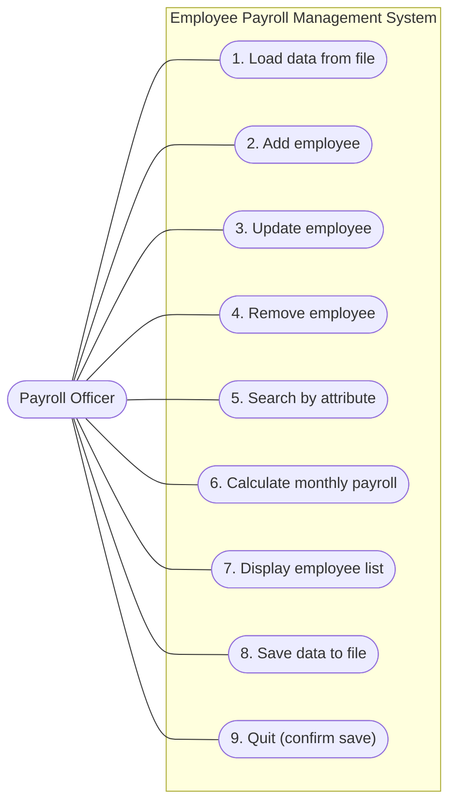
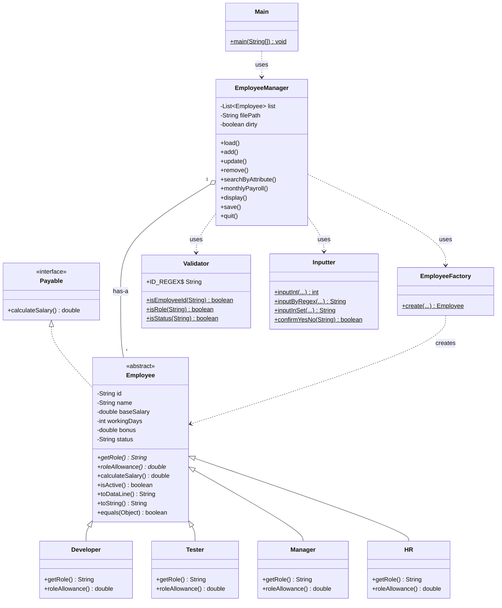
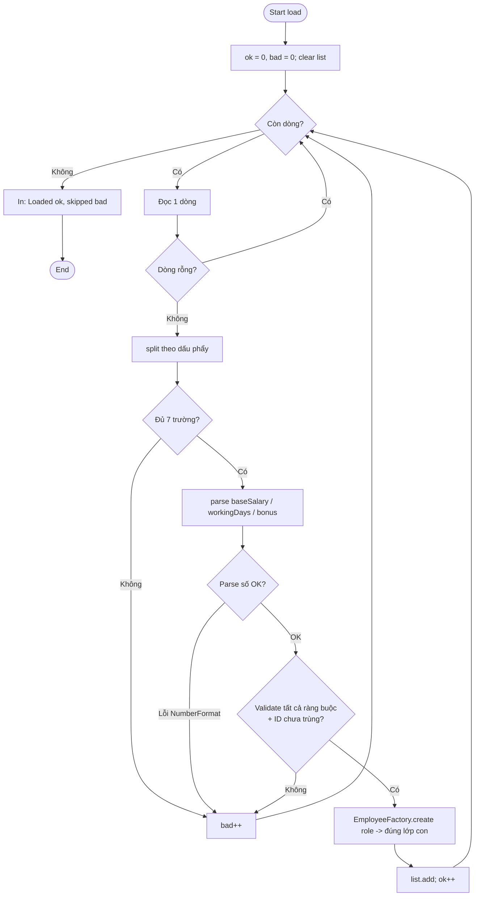
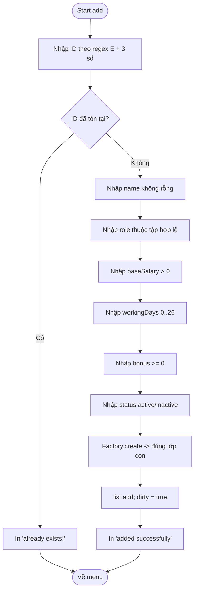
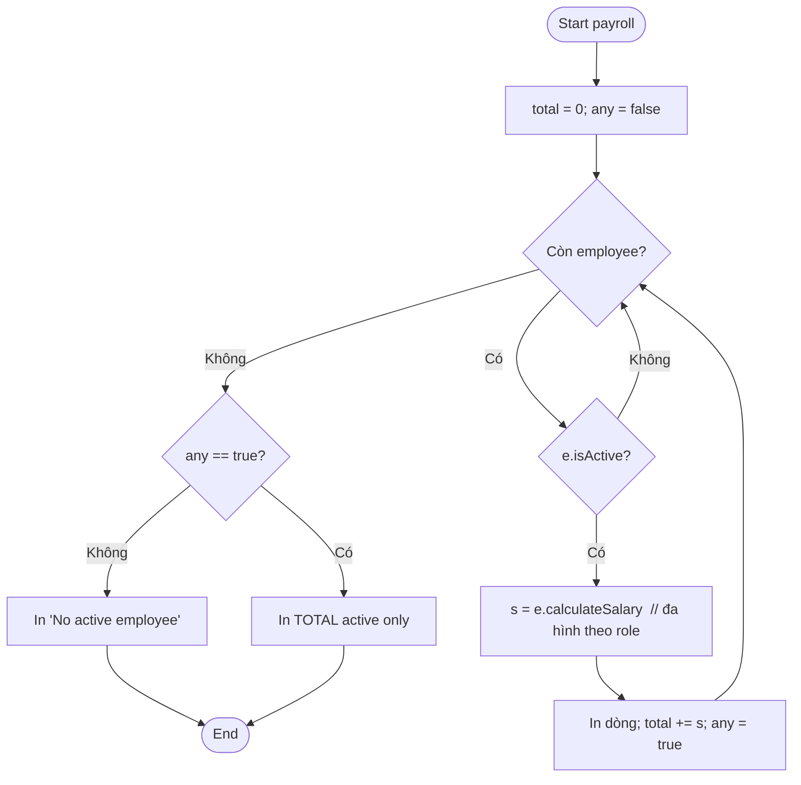
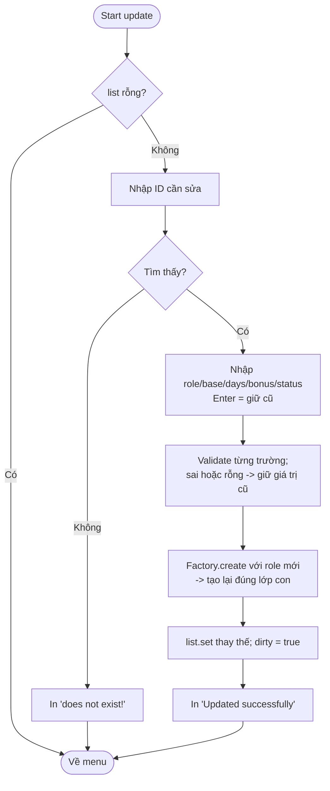

# Sơ đồ thiết kế — Employee Payroll Management System (J1.L.P0037)

> Các sơ đồ viết bằng **Mermaid**. Có thể xem trực tiếp trên GitHub/IntelliJ (plugin Mermaid)
> hoặc dán vào https://mermaid.live để xuất ra ảnh PNG/SVG đính kèm báo cáo.

---

## 1. Use Case Diagram

---

## 2. Class Diagram

---

## 3. Flowchart — Function 1: Load an toàn (xử lý dòng lỗi)

---

## 4. Flowchart — Function 2: Add employee

---

## 5. Flowchart — Function 6: Tính lương tháng (chỉ active)

---

## 6. Flowchart — Function 3: Update (Enter giữ giá trị cũ, đổi role tạo lại lớp con)

